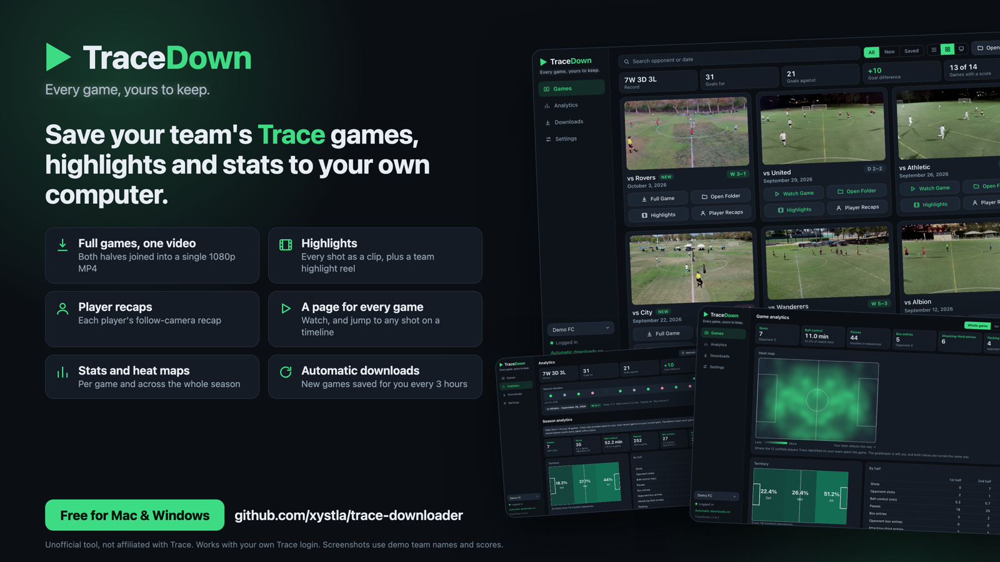
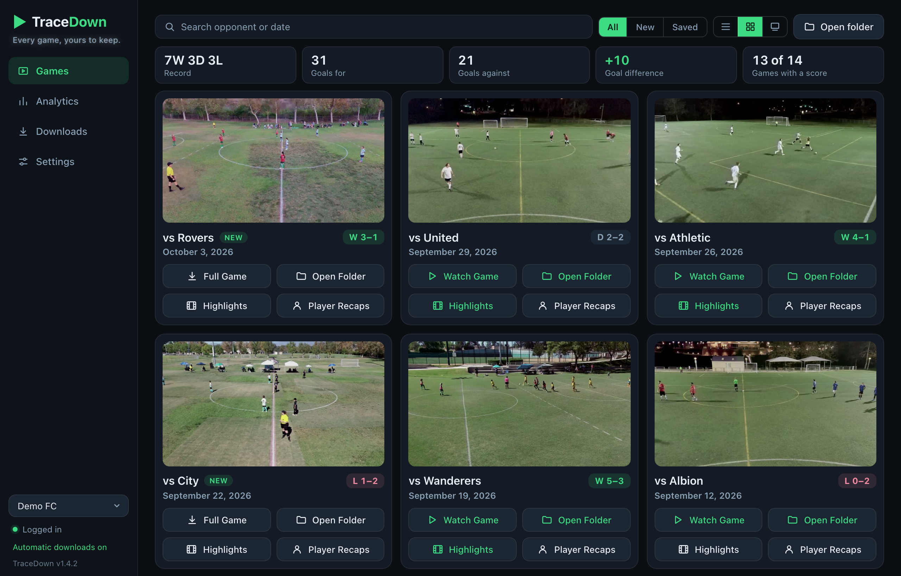
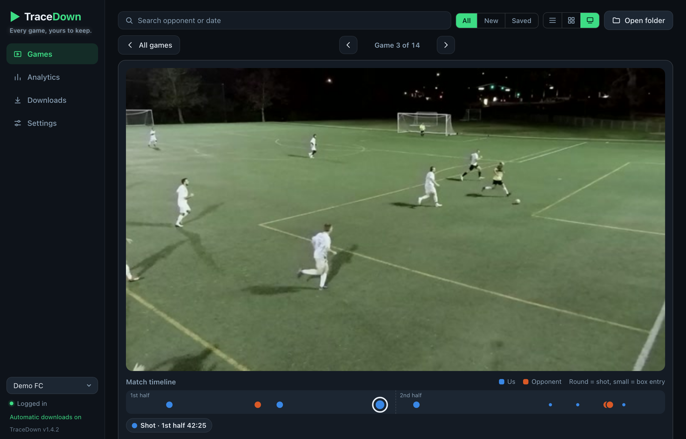
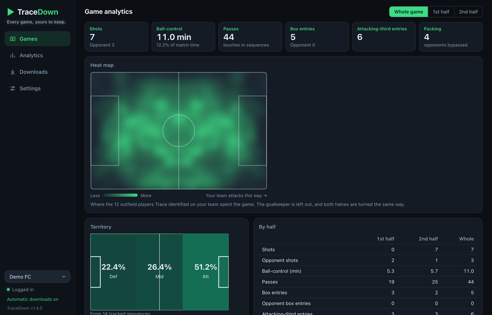
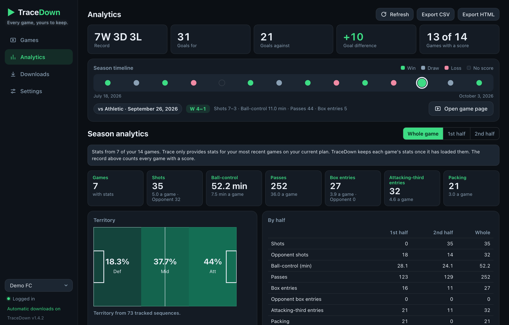
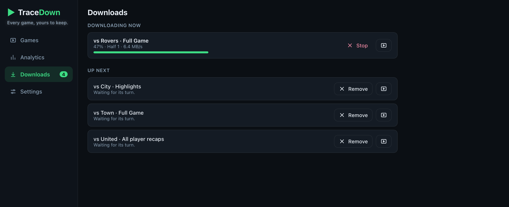

<p align="center">
  
</p>

# TraceDown

**Every game, yours to keep.**

TraceDown is a desktop app for Mac and Windows that saves your team's [Trace](https://traceup.com) soccer footage to your own computer, and gives you a better place to watch and study it. Full games, highlights, player recaps, stats and heat maps, all kept in tidy folders that are yours for good. Then make them your own: cut clips, bookmark moments, and export a game with the breaks cut out and a score bug on top.

You log in with your own Trace account. Nothing is uploaded anywhere else: no third-party accounts, no cloud storage.

<p align="center">
  
</p>

> Unofficial tool, not affiliated with or endorsed by Trace. For use with your own footage and your own Trace subscription.
> *(Screenshots use demo team names, dates and scores.)*

---

## What it does

- **Full games as one video.** Trace records each game in two halves. TraceDown downloads both and stitches them into a single 1080p MP4 with no re-encoding or quality loss, ready to watch or upload to YouTube, Hudl or Google Drive.
- **Downloads that carry on where they stopped.** Stop one, lose your connection, close the app or let the computer sleep, and Resume picks up from there instead of starting over.
- **Highlights.** Save a game's shots and box entries as clips, plus one Team Highlight Reel. No need to download the full game first.
- **Player recaps.** Download Trace's follow-camera recap for any player, or all of them at once.
- **A page for every game.** Watch in the app, jump to any shot from a match timeline, and see that game's stats underneath. A game reopens where you stopped watching.
- **Watch your way.** Any speed from quarter to double, frame-by-frame stepping, full screen, and keyboard shortcuts for all of it (press `?` to see them).
- **Bookmarks and your own clips.** Bookmark any moment with a note; it sits on the match timeline beside Trace's shots. Mark a start and an end to cut a clip of your own, saved without losing quality.
- **A game Editor.** Mark where a game starts, pauses, resumes and ends and where each goal was scored, then export it with the breaks cut out and a score bug on top that keeps the score and a running clock. Make the bug your own: three designs, six fonts, sizes, colours, corners, and crests for both teams and the league. Save a look you like and use it on any game. Exposure, contrast and saturation sliders adjust the picture. The original video is never changed.
- **Heat maps.** See where your players spent the game, drawn from Trace's player tracking.
- **Season analytics.** Your record, goals, a season timeline, totals with per-game averages, and game-by-game charts. Stats are saved as they load, so they stay after Trace stops providing them.
- **Copy and share.** Copy a game's stats as text, or its heat map as a picture, to paste into a message.
- **Automatic downloads.** TraceDown can check for new games as often as every hour or as rarely as once a day, and save what you choose for each one: the full game, highlights, player recaps. It runs quietly in the menu bar or system tray, where the menu says what it is doing, and it notifies you if your Trace login has expired.
- **A download line.** Start as many downloads as you like; they run one after another with progress, time left, Stop and Retry. Move them up and down the line.
- **Room on your disk.** TraceDown checks that a game will fit before downloading it. A Storage page shows what each game takes; on a Mac you can remove a game from there, and it goes to the Trash so it can be put back.
- **Videos that stay found.** Rename or move a video and TraceDown notices: download it again, or show where it is now. Choose how full-game videos are named, from the date, your team and the opponent.
- **Built-in updates.** The app tells you when a new version is ready and installs it for you.
- **Light and dark themes**, and three ways to browse: cards, a list, or one game at a time.

<p align="center">
  
  
</p>
<p align="center">
  
  
</p>

Each game gets its own folder:

```
Trace Videos/<Team>/2026-10-03_vs-Rovers/
  Full Game/           the game as one MP4
  Edited/              exports from the Editor
  Highlights/          clips and the Team Highlight Reel
  My Clips/            clips you cut yourself
  Player Highlights/   each player's recap
  Analytics/           stats and heat map
  Thumbnail/
```

---

## Download

Go to the [**Releases**](../../releases/latest) page and download the file for your platform:

- `TraceDown-macOS-AppleSilicon.zip` for Mac (Apple Silicon: M1/M2/M3/M4)
- `TraceDown-macOS-Intel.zip` for Mac (Intel)
- `TraceDown-Windows-Setup.exe` for Windows 10/11 (x64) — an installer

---

## Install

### macOS

1. Unzip the download for your Mac (**Apple Silicon** for M1/M2/M3/M4, **Intel** otherwise; click  → *About This Mac* if unsure).
2. Drag **TraceDown** into your **Applications** folder.
3. Double-click to open. The app is signed with a Developer ID and notarized by Apple, so it opens normally, with no security workaround needed.

### Windows

Requires Windows 10/11 (x64) and the [Microsoft Edge WebView2 Evergreen Runtime](https://developer.microsoft.com/microsoft-edge/webview2/). If TraceDown reports that WebView2 is missing, install the runtime and reopen the app.

1. Download and run `TraceDown-Windows-Setup.exe`, then click **Next → Install → Finish**. It installs for the current user (no admin prompt) and adds desktop and Start-menu shortcuts.
2. Launch **TraceDown** from the shortcut. To remove it later, use **Settings → Apps → TraceDown → Uninstall**.
3. If Windows SmartScreen appears, click **More info → Run anyway** (one-time prompt for unsigned apps).

> Installing (rather than unzipping) is also what avoids the `Failed to resolve Python.Runtime.Loader.Initialize` startup error — files written by an installer aren't blocked by Windows the way files extracted from a downloaded zip are.

The bundled Chromium engine downloads videos; WebView2 displays the app itself. Both are needed. Older builds may display a JavaScript “Syntax error” when WebView2 is missing and Windows falls back to Internet Explorer.

---

## First Launch

On **macOS**, the first launch downloads the video engine (Chromium, about 170 MB). It does this once, and again only when an update needs a newer one. The **Windows** build already includes it. Once ready:

1. Choose how the app should look and whether new games should download automatically.
2. Click **+ Add account** and log in with your Trace email address and the phone verification code.
3. Your games appear in the list.

---

## Usage

- **Full Game** downloads the game to your output folder as one continuous 1080p MP4. Prefer the two halves as separate files? Turn off **Combine both halves** in Settings.
- **Highlights** saves the game's shots and box entries as clips, with a Team Highlight Reel.
- **Player Recaps** lists the players Trace has a recap for; download one or all.
- Click a game's thumbnail to open **its page**: video, match timeline, stats and heat map. Press `?` there for the keyboard shortcuts, add bookmarks, and cut your own clips.
- **Editor** turns a saved game into a finished video: mark the start, breaks, goals and end, set up the score bug, and export.
- **Analytics** shows the whole season. Trace only provides stats for your most recent games, so open it now and then to let TraceDown keep them.
- **Downloads** shows what is running and waiting, how long is left, and how much room is free. A stopped download offers Resume and Discard.
- **Storage** shows what each game takes on your disk.
- In **Settings**, turn on automatic downloads to save new games, and choose what they fetch and how often they check. TraceDown then stays in the menu bar (Mac) or system tray (Windows) when you close the window. Quit it from there or from Settings.

---

## Maintainer / Cutting a Release

Before tagging, regenerate icons if the icon source changed:

```bash
python assets/make_icon.py
```

To publish a new release, tag and push. GitHub Actions builds both installers and attaches them to the Release automatically:

```bash
git tag v1.x
git push origin v1.x
```

Bump the version in `pyproject.toml` and `src/trace_grabber/paths.py` first, and add a section for it to `CHANGELOG.md`: that section becomes the release notes and the "What's new" list the app shows after updating.

The Actions workflow (`.github/workflows/build.yml`) runs a matrix build on macOS and Windows, produces the macOS `.zip` bundles and a `TraceDown-Windows-Setup.exe` installer (built with Inno Setup from `packaging/TraceDown.iss`), and attaches them to the GitHub Release.
